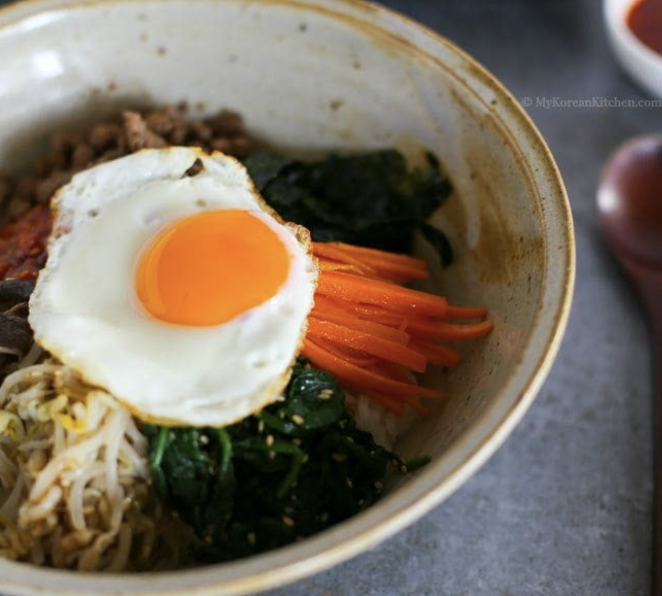

#korean #bibimbap #dinner 

# Bibimbap

Okay, so honestly, if you haven't had Korean food, you haven't lived. If there is one thing Koreans get right, it's got to be food. Their culture heavily focuses on community: Getting together with family and friends and having a nice meal.

Bimibap is ideal for using up leftover veggies. You can mix and match however you see fit. There's different meats, meat substitutes and multiple sauces you can try out to find the right version for you.  My favorite sauce is the [[Gochujang Bibimbap Sauce]]. And if you can't decide on which meat to use, I wholeheartedly recommend this [[Chicken Bulgogi]] recipe.

---
## Ingredients 

|Amount|Ingredient|
|:-:|-|
| |meat of choice|
| | bibimbap sauce of choice|
|250 g| spinach|
|350 g | bean sprouts|
|100 g| shiitake mushroom|
|120 g|carrots (4.2 ounces, 1 small)
|1/2 tsp |fine sea salt|
|3 cups |steamed rice (3 to 4 serving portions)|
|3 | eggs (3 or 4 depending on the serving portion)|
| |Some cooking oil|
| |Some toasted seasoned seaweed shredded (long thin cut)|

---
## Steps

1. Cook [spinach](https://mykoreankitchen.com/simply-seasoned-korean-spinach-salad-sigeumchi-namul-version-1/) and [bean sprouts](https://mykoreankitchen.com/korean-style-seasoned-mung-bean-sprouts-salad-sukju-namul-muchim/) per linked recipe.
2. Rinse, peel and julienne the carrots. Add some cooking oil and 1/4 tsp of fine sea salt in a wok and cook the carrots on medium high to high heat for 2 to 3 mins.
3. Clean/rinse the shiitake mushrooms and thinly slice them. Add some cooking oil and 1/4 tsp of fine sea salt in a wok and cook the mushrooms on medium high to high heat until they are all cooked. (It takes 2 to 3 mins.)
4. Make fried eggs. (While sunny side up is common, you can make them per your preference.)
5. Put the rice into a bowl and add the meat, assorted vegetables, seasoned seaweed, bibimbap sauce, and the egg on top of the rice. Serve.
6. To eat,  mix the ingredients in the bowl, and enjoy!