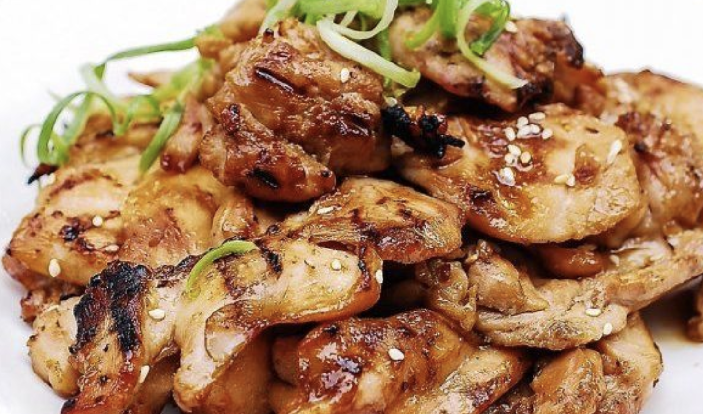

#korean #bibimbap #dinner #chicken

# Chicken Bulgogi

You like chicken? Try this! 

---

## Ingredients 
|Amount|Ingredient|
|:-:|-|
|1 lb  | Boneless Chicken Breast|
|3 Tbsp |Soy Sauce|
|1 Tbsp | Lemon Juice|
|1 Tbsp| Brown Sugar|
|1 Tbsp| Honey|
|1 Tbsp| Rice Wine or Mirin|
|1 clove|Garlic|
|1 tsp| Grated Ginger|
|1 Tbsp|Sesame Oil|
|1 pinch|Ground Black Pepper|
|1 tsp|Sesame Seeds|

---

## Steps

1. Rinse the chicken thighs (1 lb) . Trim off excess fat. Cut each of the chicken pieces into small sizes (about 2 inches long and 1 inch wide).
2. Mix the Soy Sauce (3 Tbsp) , Lemon Juice (1 Tbsp) , Brown Sugar (1 Tbsp) , Honey (1 Tbsp) , Rice Wine (1 Tbsp) , Garlic (1 clove) , Fresh Ginger (1 tsp) , Sesame Oil (1 Tbsp) , Ground Black Pepper (1 pinch) , and Sesame Seeds (1 tsp) .
3. Coat the chicken pieces with the marinade. Marinate for about 30 minutes in the refrigerator.
4. Preheat a skillet over medium high heat. Add the chicken pieces, reserving the marinade. Cook until cooked through and slightly caramelized, about 2 minutes each side. The sugar and honey in the marinade will burn easily, so watch it carefully and add the reserved marinade by tablespoon when the pan gets dry. Reduce heat if it starts to burn.
5. Serve while warm and enjoy!